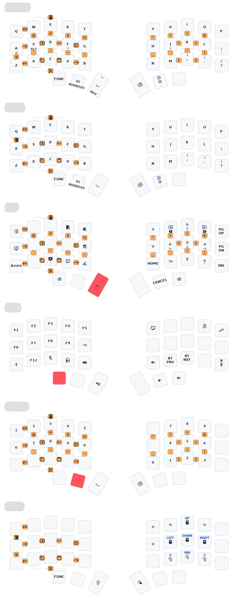

# raeldev's corne zmk-config



## Local Scripts

### 1) One-time setup

Run this once (or again when dependencies change):

```bat
.\dependencies.bat
```

This script installs required Python packages, initializes/updates `west`, exports Zephyr CMake info, and ensures Zephyr SDK `0.16.8` is available in `.tooling/`.

### 2) Firmware builds

Clean rebuild:

```bat
.\build-firmware-clean.bat
```

Faster incremental rebuild:

```bat
.\build-firmware-fast.bat
```

Both scripts:
- Build `left`, `right`, and `settings_reset`
- Copy UF2 outputs to:
  - `firmware/left.uf2`
  - `firmware/right.uf2`
  - `firmware/reset.uf2`
- Refresh keymap drawer outputs:
  - `draw/corne.yaml`
  - `draw/corne.svg`

If a build fails, the batch window pauses so you can read the error.
